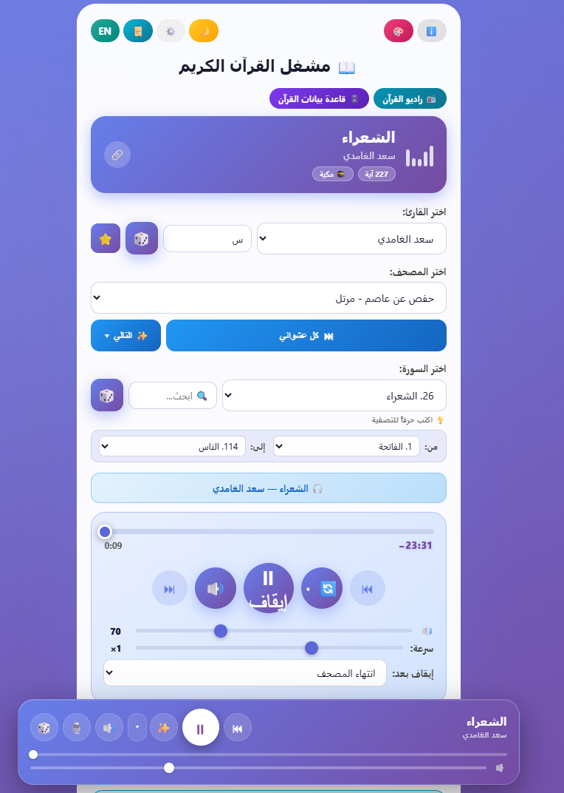
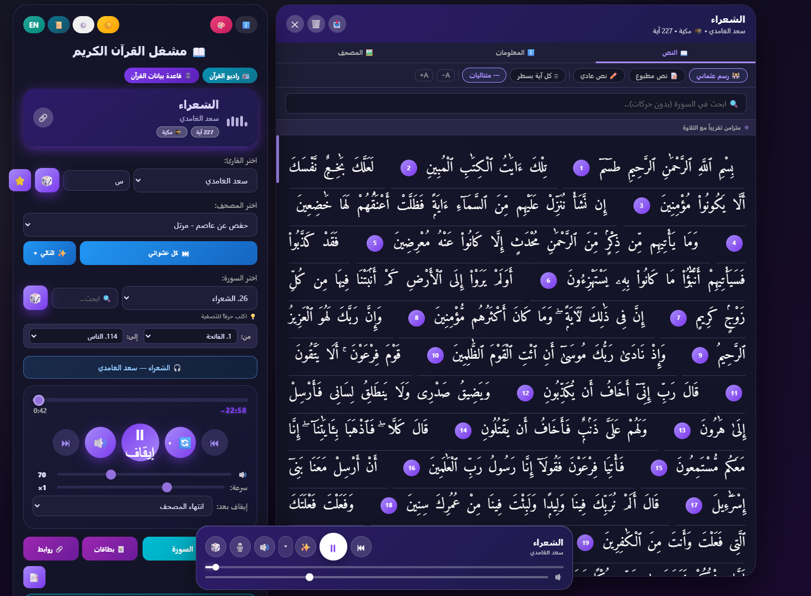
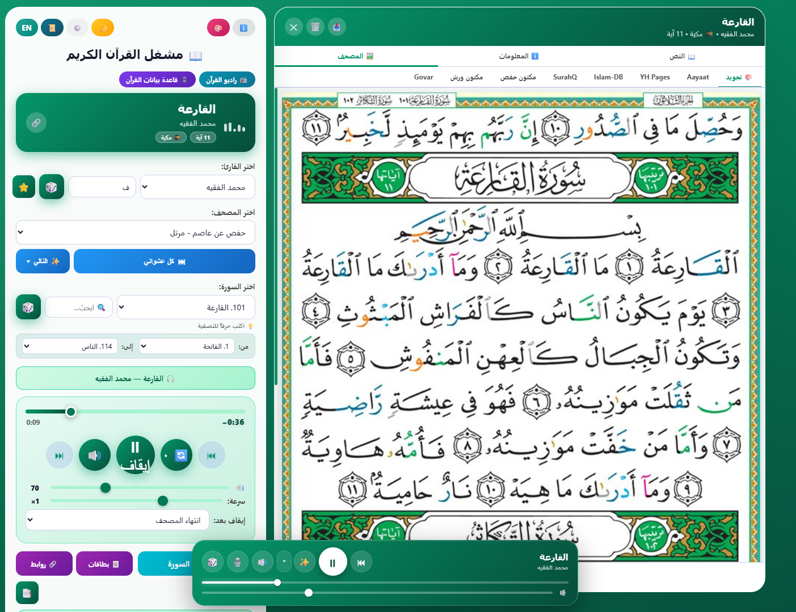
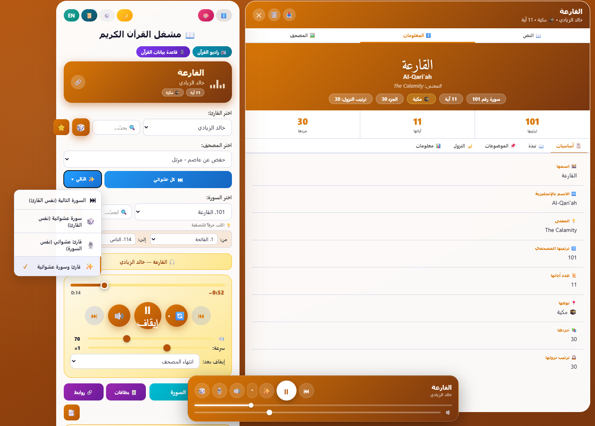

<div align="center">

# 📖 مشغل القرآن الكريم

### Quran Player — a bilingual, in-browser Quran audio player

مشغّل صوتي للقرآن الكريم يعمل مباشرةً في المتصفح، يدعم اللغتين العربية والإنجليزية،<br/>
ومبني كتطبيق ويب ثابت (Static Web App) مستضاف على GitHub Pages.

<br/>

<a href="https://alhlhli.github.io/Quran-Player/" target="_blank" rel="noopener noreferrer">
  
</a>
<a href="https://alhlhli.github.io/Quran-Player/" target="_blank" rel="noopener noreferrer">
  
</a>


🔗 **التطبيق:** <a href="https://alhlhli.github.io/Quran-Player/" target="_blank" rel="noopener noreferrer">alhlhli.github.io/Quran-Player</a>

</div>

---

## 📑 المحتويات

- [نبذة](#-نبذة)
- [المميزات](#-المميزات)
- [لقطات من التطبيق](#-لقطات-من-التطبيق)
- [اختصارات لوحة المفاتيح](#️-اختصارات-لوحة-المفاتيح)
- [التشغيل محلياً](#-تشغيل-المشروع-محلياً)
- [النشر على GitHub Pages](#-النشر على-github-pages)
- [التقنيات المستخدمة](#️-التقنيات_المستخدمة)
- [المصادر والواجهات البرمجية](#-المصادر-والواجهات-البرمجية-apis)
- [بنية المشروع](#-بنية-المشروع)
- [المصمم](#-المصمم)
- [الترخيص](#-الترخيص)

---

## 🧭 نبذة

تطبيق صفحة واحدة (SPA) خفيف وسريع، بلا أي خادم خلفي وبلا مكتبات خارجية — كل شيء يعمل داخل المتصفح مباشرةً. صُمّم بواجهة عربية كاملة من اليمين لليسار (RTL)، مع دعم إنجليزي، وتصميم متجاوب يعمل على الجوال والحاسب، وإمكانية تثبيته كتطبيق (PWA) على الشاشة الرئيسية.

> **النسخة السابقة:** متاحة على الروابط التالية للأرشفة:
> - <a href="https://alhlhli.github.io/Quran-Player/مشغل%20القرآن%20الكريم.html" target="_blank" rel="noopener noreferrer">مشغّل القرآن الكريم (النسخة الأولية)</a>
> - <a href="https://alhlhli.github.io/Quran-Player/مشغل_القرآن_v20.html" target="_blank" rel="noopener noreferrer">مشغّل القرآن الإصدار V2.0</a>

---

## ✨ المميزات

### 🎧 التشغيل والصوت
- 🎙️ **قرّاء متعددون** — اختر من بين مجموعة واسعة من قرّاء القرآن الكريم.
- 📖 **مصاحف متعددة** — اختر الإصدار/الرواية الصوتية المناسبة لكل قارئ.
- 🔄 **أوضاع التكرار** — كرّر السورة مرة أو مرتين أو ثلاثاً، أو بلا نهاية، أو أوقف التكرار.
- 🔊 **التحكم في الصوت** — شريط مستوى صوت قابل للضبط مع كتم سريع.
- ⏩ **سرعة القراءة** — تغيير سرعة التشغيل من ٠.٥× حتى ٢×.
- ⏭️ **خيارات «التالي»** — السورة التالية، أو سورة عشوائية، أو قارئ عشوائي، أو الاثنان معاً.
- 🎚️ **شريط مشغّل عائم** — تحكّم سريع يظهر أثناء التصفح.

### 🔎 التصفّح والبحث
- 🔍 **البحث في السور** — ابحث بحرف أو أكثر أو بالاسم الكامل أو بالرقم.
- 🎲 **اختيار عشوائي** — قارئ أو سورة عشوائية بنقرة واحدة (مع تحديد نطاق سور).

### 📜 نص القرآن والمصحف
- 📜 **عرض نص السورة** — بالرسم العثماني أو النص المطبوع أو النص العادي.
- 🟢 **تمييز ومزامنة** — تمييز الآية الحالية وتمرير النص تلقائياً مع التلاوة.
- 🖼️ **المصحف المصوّر** — صفحات المصحف كصور، والافتراضي **مصحف التجويد** الملوّن.
- ℹ️ **معلومات السورة** — اسمها ومعناها وترتيب نزولها وعدد آياتها ونوعها.

### 🗂️ الإدارة والتتبّع
- 📥 **تحميل السور** — تحميل أي سورة مباشرةً.
- 📚 **تحميل المصحف كاملاً** — جميع السور دفعة واحدة.
- ⭐ **المفضلة** — احفظ قرّاءك أو سورك المفضّلة.
- 🔖 **الإشارات المرجعية** — ضع إشارات على مواضع الاستماع.
- 📊 **إحصائيات الاستماع** — عدد السور وإجمالي وقت الاستماع وأكثر سورة/قارئ.
- ⏱️ **مؤقّت الإيقاف التلقائي** — أوقف بعد السورة، أو المصحف، أو مدة من ٥ دقائق إلى ٧ ساعات.
- ⏳ **مؤقّت العدّ التنازلي** — ضبط مؤقّت مخصّص.

### 🎨 الواجهة والتجربة
- 🎛️ **لوحة إعدادات شاملة** — تتحكم في كل ما يمكن تغييره من مكان واحد.
- 🌙 **سمات متعددة** — فاتح، داكن، أخضر زمردي، وذهبي.
- 🌐 **ثنائي اللغة** — واجهة كاملة بالعربية (RTL) والإنجليزية (LTR).
- 📲 **قابل للتثبيت (PWA)** — أضِفه إلى شاشتك الرئيسية كتطبيق مستقل.
- 🔗 **مشاركة** — مشاركة رابط التطبيق أو رابط السورة مباشرةً.
- ♿ **إتاحة محسّنة** — اختصارات لوحة مفاتيح، وأوصاف للأزرار، ودعم «تقليل الحركة».

---

## 🖼️ لقطات من التطبيق

<div align="center">






</div>

---

## ⌨️ اختصارات لوحة المفاتيح

| المفتاح        | الوظيفة                 |
| :------------- | :---------------------- |
| `Space`        | تشغيل / إيقاف مؤقت       |
| `→`            | السورة التالية          |
| `←`            | السورة السابقة          |
| `R`            | تغيير وضع التكرار        |
| `M`            | كتم / إلغاء كتم الصوت    |
| `T`            | عرض / إخفاء نص السورة    |
| `+` أو `=`     | رفع مستوى الصوت         |
| `-` أو `_`     | خفض مستوى الصوت         |
| `S`            | البحث في السور          |

---

## 🛠️ التقنيات المستخدمة

- **HTML5** — بنية دلالية ووسم `<audio>` للتشغيل.
- **CSS3** — متغيّرات CSS، تصميم متجاوب، دعم RTL، وسمات قابلة للتبديل.
- **JavaScript (Vanilla)** — بدون أي مكتبات أو أُطر خارجية.
- **Web App Manifest (PWA)** — قابلية التثبيت على الأجهزة.
- **GitHub Pages** — الاستضافة المجانية الثابتة.

---

## 🔌 المصادر والواجهات البرمجية (APIs)

| الغرض                | المصدر                          |
| :------------------- | :------------------------------ |
| القرّاء والصوت        | mp3quran.net API                |
| نص السور             | alquran.cloud · quran.com       |
| معلومات السور        | quranpedia.net                  |
| صور المصحف           | عدّة مصادر (الافتراضي: التجويد)  |

> جميع الحقوق للمصادر تعود لأصحابها، ويُستخدم المحتوى لأغراض الاستماع والتلاوة.

---
## 📁 بنية المشروع

```text
Quran-Player/
├── screenshots/             # لقطات الشاشة للتطبيق
├── README.md                # دليل تشغيل وتوثيق المشروع
├── index.html               # الصفحة الرئيسية الحالية للمشروع
├── script.js                # ملف العمليات والوظائف التفاعلية
├── style.css                # ملف التنسيقات والسمات المتجاوبة
├── مشغل القرآن الكريم.html    # النسخة السابقة المؤرشفة
└── مشغل_القرآن_v20.html      # إصدار الأرشفة الثاني V2.0
---


## 🛠️ التقنيات المستخدمة

- **HTML5** — بنية دلالية ووسم `<audio>` للتشغيل.
- **CSS3** — متغيّرات CSS، تصميم متجاوب، دعم RTL، وسمات قابلة للتبديل.
- **JavaScript (Vanilla)** — بدون أي مكتبات أو أُطر خارجية.
- **Web App Manifest (PWA)** — قابلية التثبيت على الأجهزة.
- **GitHub Pages** — الاستضافة المجانية الثابتة.

---

## 🔌 المصادر والواجهات البرمجية (APIs)

| الغرض                | المصدر                          |
| :------------------- | :------------------------------ |
| القرّاء والصوت        | mp3quran.net API                |
| نص السور             | alquran.cloud · quran.com       |
| معلومات السور        | quranpedia.net                  |
| صور المصحف           | عدّة مصادر (الافتراضي: التجويد)  |

> جميع الحقوق للمصادر تعود لأصحابها، ويُستخدم المحتوى لأغراض الاستماع والتلاوة.

---

## 📁 بنية المشروع

```
Quran-Player/
├── index.html        # التطبيق كاملاً (HTML + CSS + JS في ملف واحد)
├── screenshots/      # لقطات الشاشة (اختياري)
├── README.md         # هذا الملف
└── LICENSE           # رخصة المشروع
```

---

## 👤 المصمم

<div align="center">

**م/ عامر الحلحلي**

[](https://t.me/pro3mer)
[](https://github.com/Alhlhli)

</div>

---

## 📄 الترخيص

هذا المشروع مفتوح المصدر. يُرجى مراجعة ملف [`LICENSE`](LICENSE) للاطلاع على التفاصيل.

---

<div align="center">

اللهم اجعله علماً نافعاً وصدقةً جارية 🤲

<sub>صُنع بعناية — م/ عامر الحلحلي · AL3MER</sub>

</div>


## 🚀 تشغيل المشروع محلياً

لا يحتاج المشروع إلى أي خادم أو تبعيات — فقط افتح الملف في متصفّحك:
